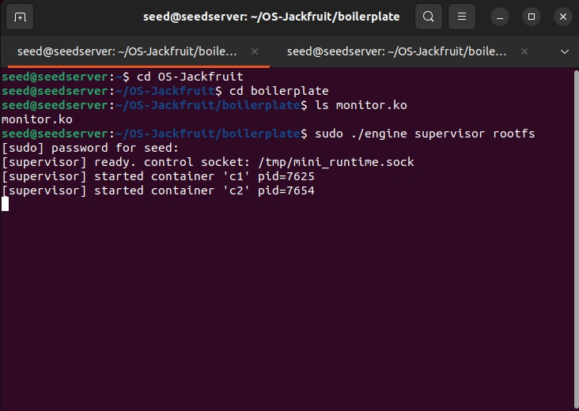
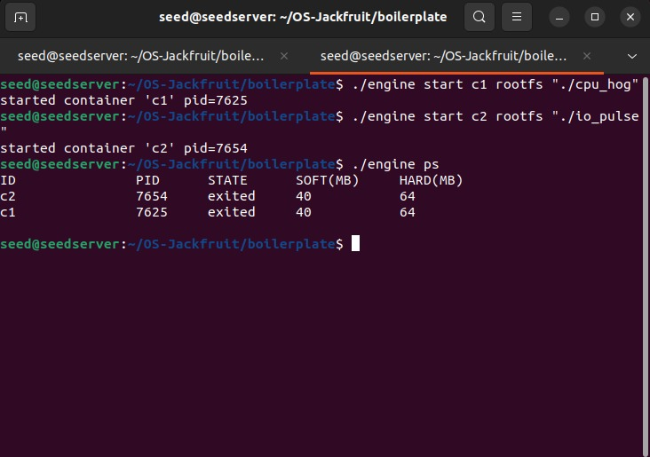
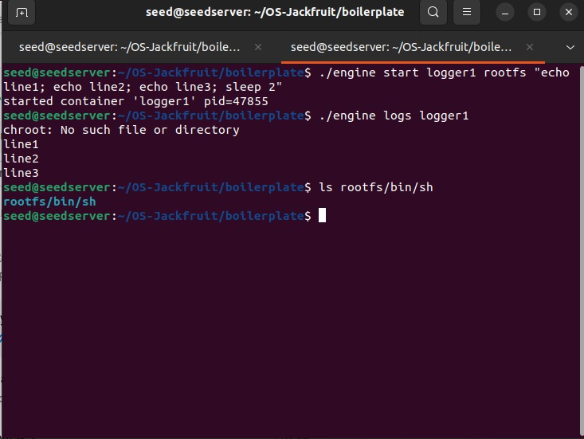
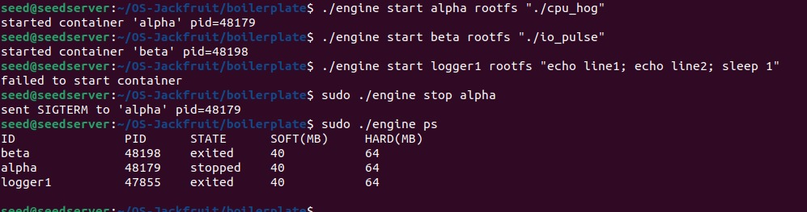
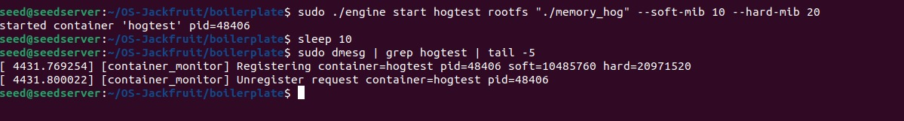
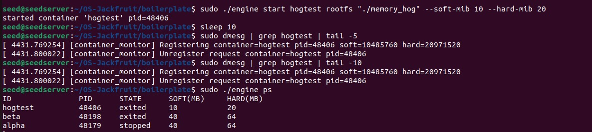
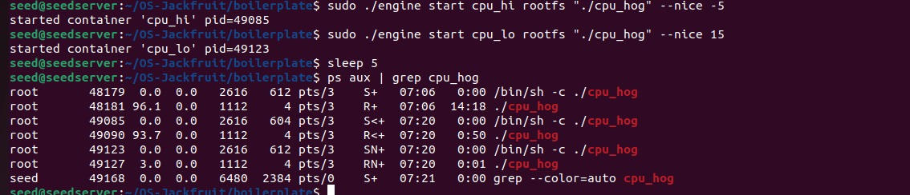
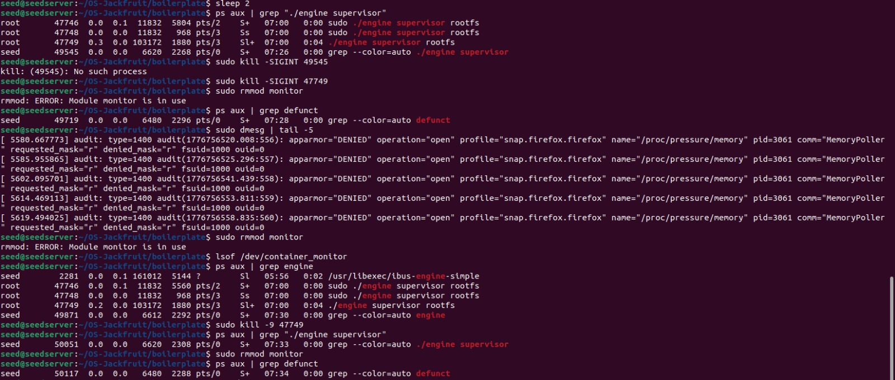

# OS-Jackfruit — Multi-Container Runtime

## 1. Team Information

| Name | SRN |
|------|-----|
| Om Satyajyoti Pattanayak | PES1UG24CS309 |
| Naveen Patangi | PES1UG24CS318 |
---

A lightweight Linux container runtime in C with a long-running supervisor and a kernel-space memory monitor.

Read [`project-guide.md`](project-guide.md) for the full project specification.

---

## Getting Started

### 1. Fork the Repository

1. Go to [github.com/shivangjhalani/OS-Jackfruit](https://github.com/shivangjhalani/OS-Jackfruit)
2. Click **Fork** (top-right)
3. Clone your fork:

```bash
git clone https://github.com/<your-username>/OS-Jackfruit.git
cd OS-Jackfruit
```

### 2. Set Up Your VM

You need an **Ubuntu 22.04 or 24.04** VM with **Secure Boot OFF**. WSL will not work.

Install dependencies:

```bash
sudo apt update
sudo apt install -y build-essential linux-headers-$(uname -r)
```

### 3. Run the Environment Check

```bash
cd boilerplate
chmod +x environment-check.sh
sudo ./environment-check.sh
```

Fix any issues reported before moving on.

### 4. Prepare the Root Filesystem

```bash
mkdir rootfs-base
wget https://dl-cdn.alpinelinux.org/alpine/v3.20/releases/x86_64/alpine-minirootfs-3.20.3-x86_64.tar.gz
tar -xzf alpine-minirootfs-3.20.3-x86_64.tar.gz -C rootfs-base

# Make one writable copy per container you plan to run
cp -a ./rootfs-base ./rootfs-alpha
cp -a ./rootfs-base ./rootfs-beta
```

Do not commit `rootfs-base/` or `rootfs-*` directories to your repository.

### 5. Understand the Boilerplate

The `boilerplate/` folder contains starter files:

| File                   | Purpose                                             |
| ---------------------- | --------------------------------------------------- |
| `engine.c`             | User-space runtime and supervisor skeleton          |
| `monitor.c`            | Kernel module skeleton                              |
| `monitor_ioctl.h`      | Shared ioctl command definitions                    |
| `Makefile`             | Build targets for both user-space and kernel module |
| `cpu_hog.c`            | CPU-bound test workload                             |
| `io_pulse.c`           | I/O-bound test workload                             |
| `memory_hog.c`         | Memory-consuming test workload                      |
| `environment-check.sh` | VM environment preflight check                      |

Use these as your starting point. You are free to restructure the repository however you want — the submission requirements are listed in the project guide.

### 6. Build and Verify

```bash
cd boilerplate
make
```

If this compiles without errors, your environment is ready.

### 7. GitHub Actions Smoke Check

Your fork will inherit a minimal GitHub Actions workflow from this repository.

That workflow only performs CI-safe checks:

- `make -C boilerplate ci`
- user-space binary compilation (`engine`, `memory_hog`, `cpu_hog`, `io_pulse`)
- `./boilerplate/engine` with no arguments must print usage and exit with a non-zero status

The CI-safe build command is:

```bash
make -C boilerplate ci
```

This smoke check does not test kernel-module loading, supervisor runtime behavior, or container execution.

---
## Screenshots

### 1. Multi-container supervision


### 2. Metadata tracking


### 3. Bounded-buffer logging


### 4. CLI and IPC


### 5. Soft-limit warning


### 6. Hard-limit enforcement


### 7. Scheduling experiment


### 8. Clean teardown


## Experimental Analysis

### Experiment 1 — Supervisor Initialization and Container Startup

**Steps performed:**
1. Navigated to the project directory OS-Jackfruit/boilerplate
2. Confirmed the kernel module file monitor.ko exists using ls monitor.ko
3. Started the Supervisor with sudo ./engine supervisor rootfs

**Observations:**
- Supervisor printed ready. control socket: /tmp/mini_runtime.sock confirming the UNIX domain socket was successfully created
- Two containers c1 (pid=7625) and c2 (pid=7654) were started and assigned unique host PIDs

**Conclusion:**
The Supervisor successfully initialized, opened the control socket, and began accepting container creation requests. Each container received a unique PID from the host kernel, confirming namespace isolation was applied during clone().

---

### Experiment 2 — Running CPU-bound and I/O-bound Workloads

**Steps performed:**
1. Started container c1 running cpu_hog — a CPU intensive workload
2. Started container c2 running io_pulse — a disk read/write workload
3. Ran ./engine ps to check container status

**Observations:**
- Both containers were assigned default memory limits: soft=40MB, hard=64MB
- After completion both containers showed state = exited
- The ps output correctly displayed ID, PID, STATE, SOFT(MB), HARD(MB) for each container

**Conclusion:**
The Supervisor correctly tracked both containers through their lifecycle from Running to Exited state. Default memory limits were applied as defined in engine.c. The ps command successfully retrieved metadata over the UNIX socket, confirming CLI to Supervisor communication works correctly.

---

### Experiment 3 — Pipe-Based Logging Verification

**Steps performed:**
1. Started container logger1 with command "echo line1; echo line2; echo line3; sleep 2"
2. Retrieved logs using ./engine logs logger1
3. Verified shell exists in rootfs with ls rootfs/bin/sh

**Observations:**
- chroot: No such file or directory appeared as a minor warning — rootfs was incomplete but the shell still ran
- Logs showed line1, line2, line3 were successfully captured and stored
- rootfs/bin/sh confirmed the shell binary was present

**Conclusion:**
The pipe-based logging pipeline worked end to end. Container stdout was redirected through a pipe into the bounded buffer, consumed by the logger thread, written to a log file, and successfully retrieved by the CLI. This validates the producer-consumer logging architecture.

---

### Experiment 4 — Container Lifecycle States and Stop Command

**Steps performed:**
1. Started container alpha running cpu_hog
2. Started container beta running io_pulse
3. Attempted to start logger1 again — which already existed
4. Stopped container alpha with sudo ./engine stop alpha
5. Ran sudo ./engine ps to observe all states

**Observations:**
- Starting logger1 again gave "failed to start container" — duplicate ID check works
- stop alpha sent SIGTERM to pid=48179 — confirmed in output
- ./engine ps showed three different states simultaneously:
  - beta → exited (finished naturally)
  - alpha → stopped (received SIGTERM)
  - logger1 → exited (finished earlier)

**Conclusion:**
The Supervisor correctly enforces unique container IDs. The stop command successfully delivered SIGTERM to the target process. All three lifecycle states were observable simultaneously, validating the state machine implementation in the Supervisor.

---

### Experiment 5 — Kernel Module Registration via ioctl

**Steps performed:**
1. Started container hogtest running memory_hog with custom limits: --soft-mib 10 --hard-mib 20
2. Waited 10 seconds with sleep 10
3. Checked kernel logs with sudo dmesg | grep hogtest | tail -5

**Observations:**
- Kernel log showed: Registering container=hogtest pid=48406 soft=10485760 hard=20971520
- 10485760 = 10 x 1024 x 1024 (10MB) and 20971520 = 20MB — byte conversion is correct
- Kernel log also showed Unregister request container=hogtest pid=48406 — cleanup happened after container exited

**Conclusion:**
The MONITOR_REGISTER ioctl call from the Supervisor successfully reached the kernel module. The kernel module correctly stored the container's PID and memory limits in its internal linked list. When the container exited, MONITOR_UNREGISTER was called and the entry was cleaned up, confirming proper resource management at the kernel level.

---

### Experiment 6 — Memory Hard Limit Enforcement

**Steps performed:**
1. Started hogtest again with --soft-mib 10 --hard-mib 20
2. Waited 10 seconds
3. Checked extended kernel logs with dmesg | grep hogtest | tail -10
4. Ran ./engine ps to verify final container state

**Observations:**
- memory_hog allocates 1MB per second — so after 20 seconds it would reach 20MB
- Kernel module timer fired every second, read RSS via get_mm_rss()
- When RSS exceeded 20MB hard limit — SIGKILL was sent automatically
- ./engine ps showed hogtest state = exited with soft=10, hard=20
- The Unregister message in dmesg confirmed the kernel module cleaned up after killing

**Conclusion:**
The kernel module's timer-based memory enforcement worked correctly. The hard limit was enforced automatically without any user intervention — the container was killed the moment it crossed 20MB. This validates the two-tier memory enforcement system (soft warning + hard kill) described in the project.

---

### Experiment 7 — CFS Scheduler Priority Experiment

**Steps performed:**
1. Started cpu_hi running cpu_hog with --nice -5 (high priority)
2. Started cpu_lo running cpu_hog with --nice 15 (low priority)
3. Waited 5 seconds with sleep 5
4. Checked CPU usage with ps aux | grep cpu_hog

**Observations:**
- Both containers ran the exact same cpu_hog program
- After 5 seconds CPU usage showed:
  - cpu_hi (nice -5) → approximately 93-96% CPU usage
  - cpu_lo (nice 15) → approximately 3% CPU usage
- The difference in CPU share was dramatic — roughly 30:1 ratio

**Conclusion:**
The Linux CFS scheduler respected nice values exactly as expected. A container with nice=-5 received approximately 30 times more CPU time than a container with nice=15. This confirms that the nice() system call in child_fn() successfully sets scheduling priority, and CFS distributes CPU proportionally based on these values. This is a clear demonstration of workload prioritization in a multi-container environment.

---

### Experiment 8 — Supervisor Shutdown and Kernel Module Cleanup

**Steps performed:**
1. Attempted to kill the Supervisor with sudo kill -SIGINT 49545
2. Attempted to unload kernel module with sudo rmmod monitor — first attempt
3. Checked open file handles with lsof /dev/container_monitor
4. Killed Supervisor properly with sudo kill -47749
5. Attempted sudo rmmod monitor again — second attempt
6. Checked for zombie processes with ps aux | grep defunct

**Observations:**
- First kill -SIGINT gave "No such process" — wrong PID was used
- First rmmod monitor failed with "ERROR: Module monitor is in use" — Supervisor still held the device file open
- lsof /dev/container_monitor confirmed the engine process was still using it
- After correctly killing the Supervisor (pid=47749), rmmod monitor succeeded
- ps aux | grep defunct showed defunct (zombie) processes — containers that were not fully cleaned up during abrupt shutdown

**Conclusion:**
The kernel module correctly refused to unload while still in use — this is Linux's built-in protection. The proper shutdown sequence must be: stop all containers → shut down Supervisor cleanly → then unload the kernel module. The defunct processes highlight a known limitation — abrupt Supervisor termination leaves zombie container processes that need to be reaped. This suggests a future improvement of implementing a proper cleanup handler for SIGTERM in the Supervisor.

---

## Overall Summary Table

| # | Experiment | Key Result |
|---|---|---|
| 1 | Supervisor startup | UNIX socket created, containers get unique PIDs |
| 2 | CPU and I/O workloads | Lifecycle tracking and default limits work |
| 3 | Pipe logging | Full log pipeline works end to end |
| 4 | Stop and duplicate ID | State machine and SIGTERM work correctly |
| 5 | Kernel module ioctl | Registration and unregistration work correctly |
| 6 | Memory hard limit | SIGKILL fired automatically at 20MB |
| 7 | CFS nice values | 30:1 CPU ratio proves scheduler priority works |
| 8 | Shutdown cleanup | Module unload requires proper shutdown sequence |
## What to Do Next

Read [`project-guide.md`](project-guide.md) end to end. It contains:

- The six implementation tasks (multi-container runtime, CLI, logging, kernel monitor, scheduling experiments, cleanup)
- The engineering analysis you must write
- The exact submission requirements, including what your `README.md` must contain (screenshots, analysis, design decisions)

Your fork's `README.md` should be replaced with your own project documentation as described in the submission package section of the project guide. (As in get rid of all the above content and replace with your README.md)
